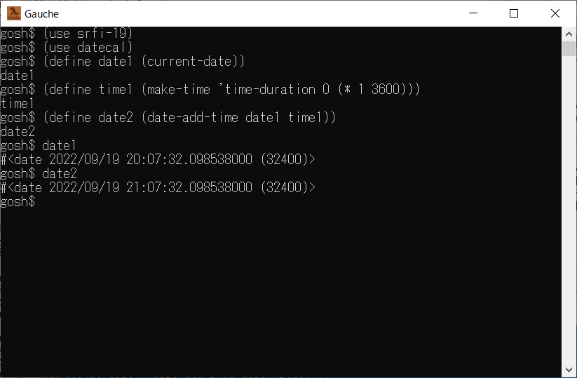

# datecal



## 概要
- Gauche で、日時の計算を行うためのモジュールです。


## インストール方法
- datecal.scm を Gauche でロード可能なフォルダにコピーします。  
  (例えば (gauche-site-library-directory) で表示されるフォルダ等)


## 使い方
- 以下を実行します。
  ```
    (use srfi-19)
    (use datecal)
  ```
  以後、本モジュールが使用可能になります。

  使用可能な変数を以下に示します。
  - `date-calc-comparator`
    - 日時 (`<date>` クラス) 計算用の比較器です。

  - `time-calc-comparator`
    - 時間 (`<time>` クラス) 計算用の比較器です。

  使用可能なメソッドを以下にしまします。
  - `(object-hash (obj <date>) rec-hash)`
    - 日時 (`<date>` クラス) のハッシュ値を計算するメソッドです。  
      本メソッドにより、default-hash や portable-hash が、  
      日時 (`<date>` クラス) に対しても使用可能になります。

  使用可能な手続きを以下に示します。
  - `(date-copy date1)`
    - 日時 (`<date>` クラス) をコピーします。

  - `(time-copy time1)`
    - 時間 (`<time>` クラス) をコピーします。

  - `(date-diff date1 date2 ...)`
    - 日時 (`<date>` クラス) を減算します。  
      戻り値は、時間 (`<time>` クラス) になります。  
      戻り値の時間のタイプは、time-duration になります。

  - `(date-add-time date1 time1 time2 ...)`
    - 日時 (`<date>` クラス) に 時間 (`<time>` クラス) を加算します。  
      戻り値は、日時 (`<date>` クラス) になります。  
      加算する時間のタイプは、time-duration である必要があります。

  - `(date-sub-time date1 time1 time2 ...)`
    - 日時 (`<date>` クラス) から 時間 (`<time>` クラス) を減算します。  
      戻り値は、日時 (`<date>` クラス) になります。  
      減算する時間のタイプは、time-duration である必要があります。

  - `(time-add time1 time2 ...)`
    - 時間 (`<time>` クラス) を加算します。  
      戻り値は、時間 (`<time>` クラス) になります。  
      time2 以降の加算する時間のタイプは、time-duration である必要があります。

  - `(time-sub time1 time2 ...)`
    - 時間 (`<time>` クラス) を減算します。  
      戻り値は、時間 (`<time>` クラス) になります。  
      time2 以降の減算する時間のタイプは、time-duration である必要があります。


## 使用例
1. [linseg](https://github.com/Hamayama/lineseg) モジュール の
   [サンプルプログラム](https://github.com/Hamayama/lineseg/blob/main/sample-date-time.scm) を、
   参照ください。  
   (日時の範囲を設定して、勤務時間を計算するサンプルです)


## 環境等
- OS
  - Windows 10 (version 21H2) (64bit)
- 言語
  - Gauche v0.9.12

## 履歴
- 2022-9-19  v1.00 (初版)
- 2022-9-23  v1.01 date-copy と time-copy を追加。  
  日時の object-hash を追加。  
  date-calc-comparator と time-calc-comparator を見直し。  
  date-diff, date-add-time, date-sub-time について、  
  time-utc ではなく time-monotonic に変換して計算するように変更。


(2022-9-23)
